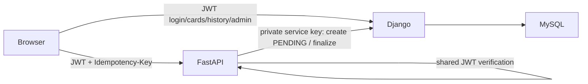

# CardLab — simulated credit/debit card payment system

**Educational simulation only. NOT a real payment gateway. Never enter actual card numbers, CVV, PIN or personal payment credentials. No funds move and no provider integration is present.**

## Architecture and stack

- Django 5.2 + Django REST Framework own users, hashed passwords, cards, transactions, role-based admin endpoints, migrations, and the MySQL 8.4 database.
- FastAPI + Pydantic own `/payments`, payment validation and deterministic simulation. FastAPI does **not** write Django-owned tables directly: it verifies Django-issued HS256 JWTs (`iss`, `aud`, `exp`, `iat`, `jti`, `token_type`, `user_id`), then calls private Django endpoints using a separate shared service key to verify card ownership and atomically create/finalize transactions. Both services use the same signing key and issuer/audience. Rotate both together. The service key is never sent to the browser.
- Vite + React 19 + React Router + Tailwind 4 provide a minimal demo client. Axios uses memory-only access/refresh tokens (page refresh signs you out); HTTPS is mandatory outside local development.
- Docker Compose wires MySQL, Django (WhiteNoise for Admin/static assets), FastAPI and an nginx-served frontend. The browser connects to exposed host ports; containers use DNS name `django`/`mysql` on the private Compose network.



## Features and flow

Registration creates a non-admin user; login returns a 15-minute access token and one-day rotating refresh token. Logout blacklists the refresh token. Access tokens remain valid until expiration; no access-token revocation list is implemented. Authenticated users add/list/delete their own masked cards and see only their transactions. Staff may read all users/cards/transactions, view daily successful-payment summaries and status counts, update user active flags, export CSV and inspect admin activity. Only superusers may promote staff. The Django Admin UI also permits authorized administrative management.

**Payment sequence:** Browser sends access token + selected card, positive USD amount (two decimals max) and optional `Idempotency-Key` to FastAPI → FastAPI validates JWT and payload → Django validates active owner/card → Django commits `PENDING` → FastAPI simulates: amounts **≤ USD 1000.00 succeed; > USD 1000.00 fail** → Django atomically commits `SUCCESS`/`FAILED` → FastAPI returns result. A retry with the same key and identical fields returns the same transaction (including after card deletion); changed fields return 409. After an interrupted request a PENDING row can be finalized by retrying the same key; no background recovery worker is provided. Without a key, every call generates a new key; clients should supply one.

The Django serializer transiently accepts a Luhn-valid *test number* and discards it after computing the brand and last four. **It does not know whether a submitted Luhn-valid number is real; only use synthetic published test values.** CVV/PIN fields are rejected, not accepted or stored. No full number is retained in models, API responses or intentional application logs. Disable request-body tracing at ingress/monitoring and avoid real card data entirely.

## Repository layout

```text
backend/django_app/       Django configuration, users, cards, transactions, admin_panel, tests, migrations, OpenAPI
backend/fastapi_service/  Payment API, JWT validation, simulator, tests
frontend/                 React views, memory-only auth, Tailwind, nginx image
database/                 MySQL Docker image and schema documentation
postman/                  Importable API collection
screenshots/              Screenshot instructions (no fabricated captures)
docker-compose.yml        Four-service setup
.env.example              Configuration template (never commit .env)
pytest.ini                Combined test configuration
```

## Quick start (Docker)

Prerequisites: Docker Engine/Desktop with Compose v2. Copy `.env.example` to `.env` at the repository root, replace **all** placeholder secrets with three different strong random values and set a unique DB password/root password. Set `DJANGO_ALLOWED_HOSTS` and `CORS_ALLOWED_ORIGINS` to the exact hosts/origins you use. The provided host URLs assume the browser is on the same machine as Compose; for remote deployments set `VITE_DJANGO_URL` / `VITE_PAYMENT_URL` to public HTTPS URLs and rebuild the frontend.

1. Create `.env` from `.env.example`, edit its values. On Windows PowerShell: `Copy-Item .env.example .env`.
2. Start: `docker compose up --build -d`.
3. Create an admin interactively: `docker compose exec django python manage.py createsuperuser` (choose your own credentials; none are seeded or committed).
4. Visit frontend **http://localhost:5173**, Django docs **http://localhost:8000/api/docs/**, FastAPI docs **http://localhost:8001/docs**, Django Admin **http://localhost:8000/django-admin/**.
5. Shut down: `docker compose down`; `docker compose down -v` **deletes** the MySQL volume.

The Django container applies migrations and collects static files before starting gunicorn. Do not deploy this development Compose file unchanged to the public internet: see Security. Docker/MySQL startup has **not** been verified on the authoring Windows machine: the Docker CLI is not installed there. Install Docker Desktop with WSL 2/virtualization enabled by an administrator, then verify `docker compose up --build` on that host. Local SQLite data is separate and is **not** migrated automatically into MySQL.

## Local development without Docker

For a local demo *without Docker*, use SQLite (Python **3.13** and Node.js **22+** required); the deployed database remains MySQL. Start all three programs in **separate PowerShell terminals at the repository root**. Copy `.env.example` to `.env` once and replace every placeholder secret/password with your own distinct random values. The untracked `.env` is read into each terminal by [scripts/load-env.ps1](scripts/load-env.ps1); it is never committed. Keep `JWT_SIGNING_KEY`, issuer, audience and `SERVICE_API_KEY` identical between the two Python services. In the first terminal:

```powershell
Copy-Item .env.example .env
# Edit .env now; do not keep the example secrets or database passwords.
py -3.13 -m venv .venv
& .\.venv\Scripts\python.exe -m pip install -r backend\django_app\requirements.txt -r backend\fastapi_service\requirements.txt
& .\scripts\load-env.ps1
$env:DB_ENGINE='sqlite'
$env:DJANGO_ALLOWED_HOSTS='localhost,127.0.0.1'
& .\.venv\Scripts\python.exe backend\django_app\manage.py migrate
& .\.venv\Scripts\python.exe backend\django_app\manage.py runserver 127.0.0.1:8000
```

In a second terminal at the repository root:

```powershell
& .\scripts\load-env.ps1
$env:DJANGO_INTERNAL_URL='http://127.0.0.1:8000'
$env:PYTHONPATH='backend\fastapi_service'
& .\.venv\Scripts\python.exe -m uvicorn app.main:app --host 127.0.0.1 --port 8001
```

In a third terminal at the repository root:

```powershell
npm ci --prefix .\frontend
npm run dev --prefix .\frontend
```

Open `http://localhost:5173`. Register a user in the UI; to get a superuser for admin pages, open a **fourth** PowerShell terminal, load `.env`, set `DB_ENGINE=sqlite`, and run `& .\.venv\Scripts\python.exe backend\django_app\manage.py createsuperuser` (type your password directly into the terminal). Django does **not** read `.env` automatically. If running an independently installed local MySQL instead, set `DB_ENGINE=mysql`, `DB_HOST=127.0.0.1` and your real DB credentials before Django migrations; you must create that MySQL database/user separately. Do not run the local SQLite and MySQL backends as if they shared data.

## Configuration

All expected variables are in [.env.example](.env.example): `DJANGO_SECRET_KEY`, `JWT_SIGNING_KEY`, `JWT_ISSUER`, `JWT_AUDIENCE`, `SERVICE_API_KEY`, `DJANGO_DEBUG`, `DJANGO_ALLOWED_HOSTS`, `CORS_ALLOWED_ORIGINS`, `DB_ENGINE`, `DB_NAME`, `DB_USER`, `DB_PASSWORD`, `DB_ROOT_PASSWORD`, `DB_HOST`, `DB_PORT`, `DJANGO_INTERNAL_URL`, `VITE_DJANGO_URL`, `VITE_PAYMENT_URL`. Optional `SECURE_SSL_REDIRECT=true` for TLS-terminated production deployments when forwarded HTTPS is configured correctly. Secrets are required at startup, never defaulted to production values. Browser URLs are baked in at frontend build time.

## API documentation and status codes

Detailed OpenAPI: Django `/api/schema/` (downloadable YAML; checked-in snapshot [backend/django_app/schema.yaml](backend/django_app/schema.yaml)), interactive Django `/api/docs/`; FastAPI `/openapi.json` and `/docs`. Django's `/internal/` service routes are intentionally omitted from public OpenAPI and require `X-Service-Key`. Import [postman/credit-card-payment-system.json](postman/credit-card-payment-system.json) into the installed Postman Desktop app for manual testing: set `base_url=http://localhost:8000` and `payment_url=http://localhost:8001`; register (change the example username on subsequent runs), login (the response script saves tokens), add a **synthetic** card (script saves its ID), make payment, inspect transaction history (script saves a transaction ID), filter and inspect details. Delete the card **after** making a payment; logout last. For admin requests, create a Django superuser, log in again with that account and set the `user_id` variable appropriately; regular-user requests to admin endpoints must return 403. Do not sync live credentials to shared Postman workspaces.

For **repeatable, asserted Postman testing**, import [postman/cardlab-smoke.json](postman/cardlab-smoke.json) into Postman and run its 12 requests in order with Collection Runner, or run `npx --yes newman run postman/cardlab-smoke.json` from the repo root. It creates a new synthetic user on every run and asserts login, card masking, successful and failed simulated payments, history/filter/detail, deletion and logout. This was executed against the live local SQLite-backed services on September 28, 2026: **12 requests, 13 assertions, 0 failures**. It does not test the separate staff-only/admin endpoints or MySQL; those require a superuser and a running Docker/MySQL deployment.

| Method | Endpoint | Access | Purpose |
|---|---|---|---|
| POST | `/api/auth/register/`, `/api/auth/login/`, `/api/auth/token/refresh/` | public | Register, login, rotate refresh |
| POST | `/api/auth/logout/` | user | Blacklist refresh |
| GET | `/api/auth/me/` | user | Current profile |
| GET, POST | `/api/cards/` | user | List/add masked cards |
| DELETE | `/api/cards/{id}/` | owner | Delete a card |
| POST | `http://localhost:8001/payments` | user JWT | Simulate payment |
| GET | `/api/transactions/`, `/api/transactions/{id}/` | owner | Paginated history/detail |
| GET | `/api/admin/users/`, `/api/admin/cards/`, `/api/admin/transactions/` | staff | Global lists |
| PATCH | `/api/admin/users/{id}/` | staff | Activate/deactivate (superuser for staff flag) |
| GET | `/api/admin/summary/`, `/api/admin/logs/` | staff | Totals, daily data, activity |
| GET | `/api/admin/transactions/export/` | staff | Filtered CSV |

Transaction filter query parameters: `date_from`, `date_to` (YYYY-MM-DD), `amount_min`, `amount_max`, `status` (`PENDING`, `SUCCESS`, `FAILED`), `page`. Admin transaction list and CSV use the same filters. DRF lists are paginated at 20 per page. Registration/payment creation return 201, reads 200, deletion/logout 204; invalid fields 400/422, unauthenticated 401, forbidden 403, missing owned objects 404, idempotency conflict 409, unavailable upstream 503. Django serializer errors use field-to-messages JSON, FastAPI uses `detail`; neither includes raw PAN. The admin user list includes admins themselves.

## Database and backups

See [database/README.md](database/README.md) for the ER diagram, keys, indexes, deletion semantics, migration and dump instructions. `User` extends Django `AbstractUser`; `Card` contains only last four, not even a stored masked-number field. Transactions retain a card ID snapshot and last four even after the card is removed. Apply migrations with `docker compose exec django python manage.py migrate`. Never commit or distribute dumps containing user PII.

**Data connection:** React in the browser never connects to MySQL or SQLite. It calls Django at `VITE_DJANGO_URL` for auth/cards/history/admin and FastAPI at `VITE_PAYMENT_URL` for payments. FastAPI calls Django over `DJANGO_INTERNAL_URL` using a service key; Django ORM reads/writes the database specified by `DB_ENGINE`/`DB_*`. In Docker, the database host is **`mysql`**, *not* `localhost`; the browser talks to exposed host ports 8000/8001. Frontend `VITE_*` variables are injected at **build time**; rebuild after changing them. The table names are `users_user`, `cards_card`, `transactions_transaction`, `admin_panel_adminlog`, plus Django auth/session/migration/token tables.

To see the **currently running local SQLite** tables from the repository root, without opening or printing user records:

```powershell
& .\.venv\Scripts\python.exe -m sqlite3 backend\django_app\db.sqlite3 "SELECT name FROM sqlite_master WHERE type='table' ORDER BY name;"
& .\.venv\Scripts\python.exe -m sqlite3 backend\django_app\db.sqlite3 'PRAGMA table_info(cards_card);'
& .\.venv\Scripts\python.exe -m sqlite3 backend\django_app\db.sqlite3 'SELECT status, COUNT(*) FROM transactions_transaction GROUP BY status;'
```

After Docker is installed and MySQL is started with Compose, open the MySQL CLI **inside the container** (the DB port is deliberately not exposed to the host):

```powershell
docker compose ps
docker compose exec mysql sh -c 'mysql -u "$MYSQL_USER" -p "$MYSQL_DATABASE"'
```

Type the password from your private `.env` directly at the MySQL prompt; do not paste it into chat or commands. Inside MySQL run `SHOW TABLES;`, `DESCRIBE cards_card;`, `DESCRIBE transactions_transaction;` and `SELECT status, COUNT(*) FROM transactions_transaction GROUP BY status;`. Or visit `/django-admin/` as a superuser for a permission-controlled GUI to users/cards/transactions/admin logs. A MySQL GUI tool would require a separately configured, loopback-only database port; there is no external MySQL port in the default Compose file.

## Tests and coverage

The test suite covers registration, hashed passwords, login/refresh/logout, access control, card masking/CVV rejection, isolation, deletion, ownership, pending→success/failure, idempotency, payment validation, transaction filters, admin authorization/CSV/logging, JWT validation, cross-service payment flow and upstream failure sanitization. Run from repo root in a Python virtualenv with both requirements installed. Use synthetic secrets and SQLite **only in tests**:

```powershell
$env:DJANGO_SECRET_KEY='test-secret-not-for-production'
$env:JWT_SIGNING_KEY='test-jwt-signing-key-at-least-16'
$env:JWT_ISSUER='credit-card-django'
$env:JWT_AUDIENCE='credit-card-services'
$env:SERVICE_API_KEY='test-service-key-at-least-16'
$env:DJANGO_ALLOWED_HOSTS='localhost,127.0.0.1,testserver'
$env:DB_ENGINE='sqlite'
$env:PYTHONPATH='backend\django_app;backend\fastapi_service'
& .\.venv\Scripts\python.exe -m pytest --cov=backend/django_app --cov=backend/fastapi_service/app --cov-report=term --cov-fail-under=50
```

Coverage is measured for both Python services (frontend not included); Django test modules and migrations currently count in the overall percentage. The latest run passed 15 tests and exceeded 50%; rerun for current evidence. MySQL-specific behavior and Docker boot must additionally be checked on a Docker-enabled host.

## Security and operational limitations

- JWTs use a dedicated shared signing key, issuer/audience, expiry, refresh rotation and blacklist; Django checks current active/staff state on authenticated calls. FastAPI rechecks card ownership and user activity through Django for each payment. Signing key rotation requires deploying both services together; an asymmetric signing setup is advisable when services are distributed.
- Backend ORM/validated filters prevent SQL string interpolation; fixed error messages avoid leaking internal details. Django session-based Admin uses CSRF middleware; browser API calls use bearer headers rather than CSRF-exempt credential cookies. CORS is restricted to configured origins. Secret key and MySQL credentials come from environment only.
- A browser-accessible Compose host publishes Django's `/internal/` path: the shared service key protects it, **but production must also firewall/reverse-proxy block `/internal/`, disallow external access to internal endpoints, use TLS everywhere, rate-limit at ingress, rotate service credentials and configure trusted forwarded headers**. This Compose layout is an educational demo, not a public hardened payment deployment. Disable request-body/access tracing of card submission; turn off debugging. Add centralized audit/observability and recovery for long-lived PENDING payments before production use.
- Accepts Luhn-valid numbers transiently but cannot technically prevent entry of an actual card: **never use this service with real payment data**. No CVV or PIN is accepted. No PCI certification, fraud detection, refunds, chargebacks, charge capture, external payment integration or real settlement.
- CSV export can contain user-associated transaction data; restrict access and protect downloaded files. No seed admin credentials are committed. Browser tokens live in memory only and disappear on reload; still protect the app against XSS using trusted scripts and CSP in real deployments.

## Screenshots

See [screenshots/README.md](screenshots/README.md) for the capture checklist. Actual screenshots are not included until the application is run in a browser; do not use real card details in captures.

## Future improvements

Asymmetric JWT signing and key rotation; background job to reconcile stale PENDING records; MySQL-backed service-level integration tests in CI; production ingress/TLS/CSP/metrics and per-user payment throttles; frontend automated tests; container image scans; accessible admin pagination and exports; short-lived cross-service credentials.

## Suggested Git history

`feat: implement JWT authentication` · `feat: add card management APIs` · `feat: implement payment simulation service` · `feat: add transaction filtering` · `feat: add admin dashboard` · `test: add authentication and payment test suites` · `docs: document API and data schema` · `chore: add Docker Compose configuration`. Initialize with `git init` and commit files **except** `.env`, database dumps and private secrets.